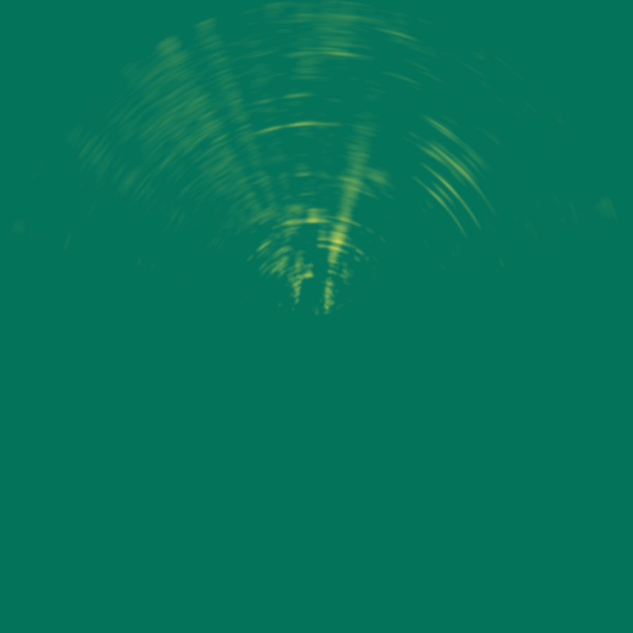
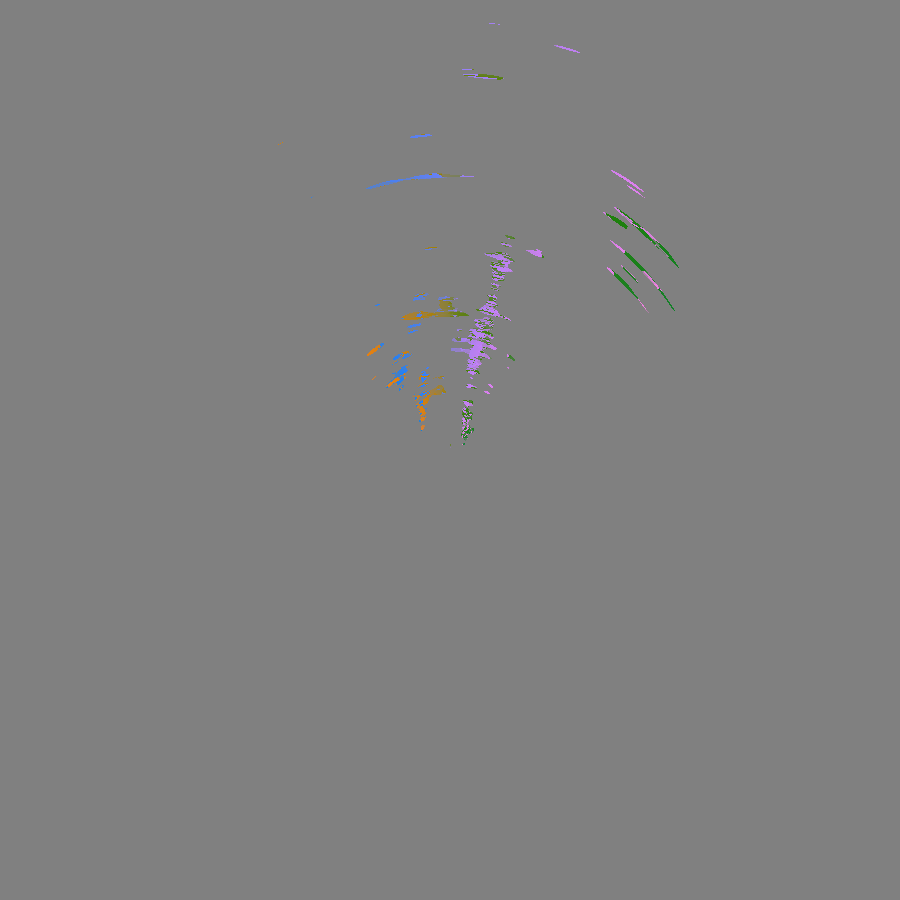
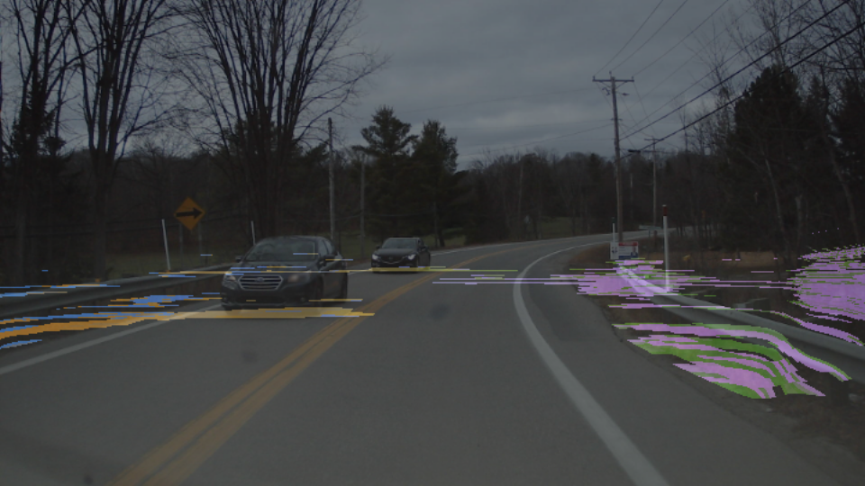
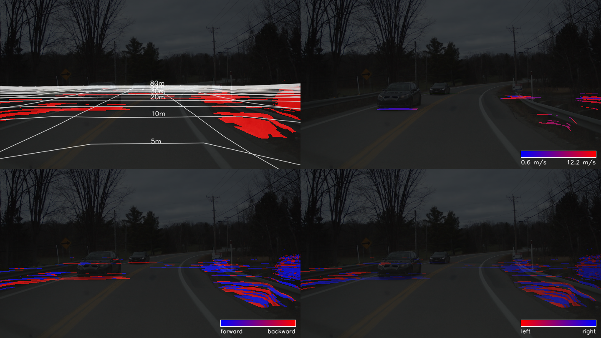
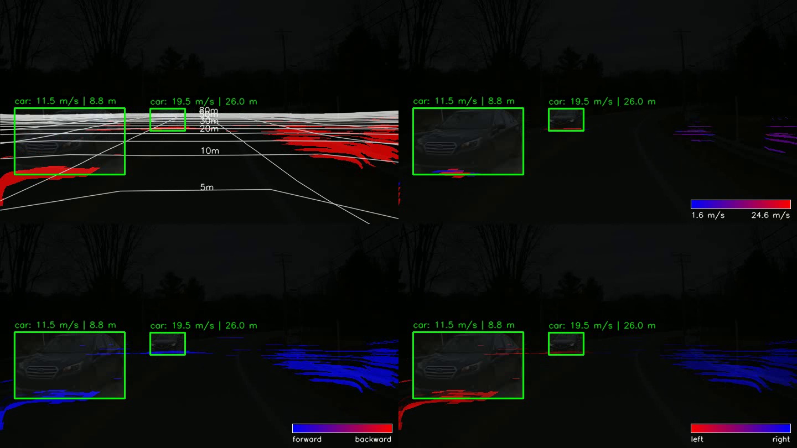

# RADIal Radar-Camera Fusion

A lightweight radar-camera fusion demo using the RADIal dataset, ROFusion calibration files, bird's-eye-view radar projection, camera-space overlays, and YOLO vehicle detections.

## Overview

This notebook reconstructs synchronized radar and camera data from a RADIal raw recording, converts the radar signal into a calibrated top-down minimap, projects radar intensity and velocity back into the camera view, and samples radar motion inside detected vehicle regions.

The focus is an interpretable demonstration of radar-camera alignment and fusion.

## Demo

Open [`demo.ipynb`](demo.ipynb) directly in Google Colab with the badge above.

The notebook downloads the required RADIal recording and ROFusion calibration files into Colab's runtime workspace. No dataset files are stored in this repository.

The first data download can take around 15 minutes, and may take 30 minutes or longer when the source is busy. The main image-based results are produced before the final video-rendering cell; generating the full video can take another 30 minutes. Keep the Colab tab open while these cells are running.

## Results

### Video Demo

https://github.com/user-attachments/assets/85a1ea6c-8a84-412e-8a81-b24dc9851211

### Radar BEV Minimap

### Radar Velocity Map

### Camera Overlay

### Velocity Panel

### YOLO + Radar Fusion

## Data and Credits

This project uses the public [RADIal dataset](https://github.com/valeoai/RADIal) and calibration files from [ROFusion](https://github.com/LiuLiu-55/ROFusion). YOLO vehicle detections are produced with [Ultralytics YOLOv8](https://github.com/ultralytics/ultralytics).

Please cite and follow the licenses of the original datasets, models, and calibration sources when reusing this work.

## License

The original code and documentation in this repository are provided under the MIT License.

Copyright (c) 2026 Contributors

Permission is hereby granted, free of charge, to any person obtaining a copy of this repository and associated documentation files, to deal in the repository without restriction, including without limitation the rights to use, copy, modify, merge, publish, distribute, sublicense, and/or sell copies, subject to the following conditions:

The above copyright notice and this permission notice shall be included in all copies or substantial portions of the repository.

This repository is provided "as is", without warranty of any kind, express or implied, including but not limited to the warranties of merchantability, fitness for a particular purpose, and noninfringement. External datasets, pretrained models, and calibration files remain under their respective licenses.
